# Misc - Devil (7 solves / 477 points)

  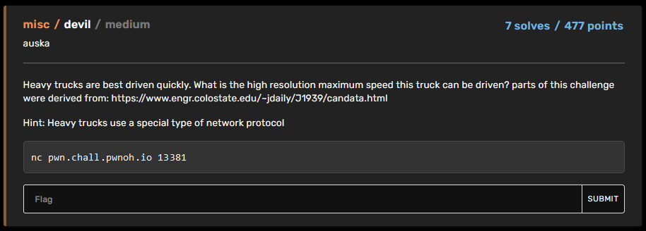

## Write-up :
Just so you know, we'll be going through two different paths to solve this challenge : the (more or less) intended one that I couldn't find and the one I went through during the competition, more interesting but also clearly less straightforward (fully manual)... Let's dive into it by starting with the steps they've in common.

### Common steps :
The challenge description talks about a network protocol that is used by heavy trucks. When looking at the link provided in the description, we can identify this protocol as **SAE J1939**. It's a higher-layer protocol base on **Controller Area Network (CAN)** and its main functions are communication and diagnostics among vehicle components which could be interesting since the information we're looking for to solve this challenge is "the high resolution maximum speed *a truck* **can be** driven". We've also at our disposal an address and a port we can contact so let's do it to see what input we have to solve our problem.

  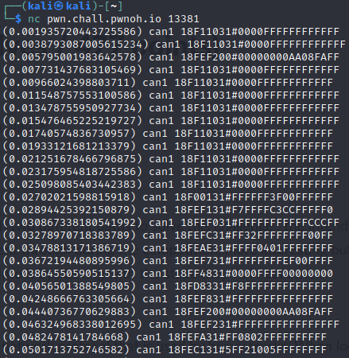

The data keep coming for more than a minute before it asks for the answer we talked about earlier. The link between this data and the protocol we found is obvious and by looking deeper into the link we've been given, we can find a useful tool that can be used to translate this kind of data into actual information coming from the various parts, microcontrollers and sensors of the involved truck : 

  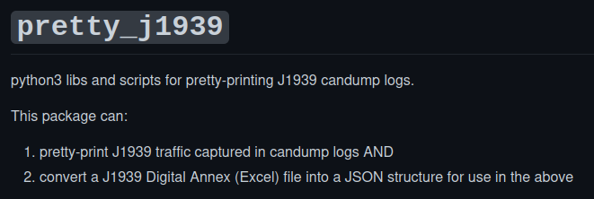
  <label>https://github.com/nmfta-repo/pretty_j1939</label>

It seems a bit too easy but let's see what we can get from this tool :

- 1. Capture the CAN data : 

  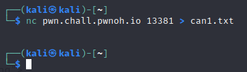

- 2. Clone the pretty_1939 tool's repo :

  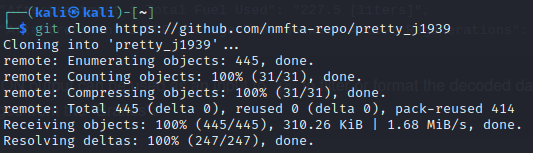

- 3. Extract the data from our capture :

  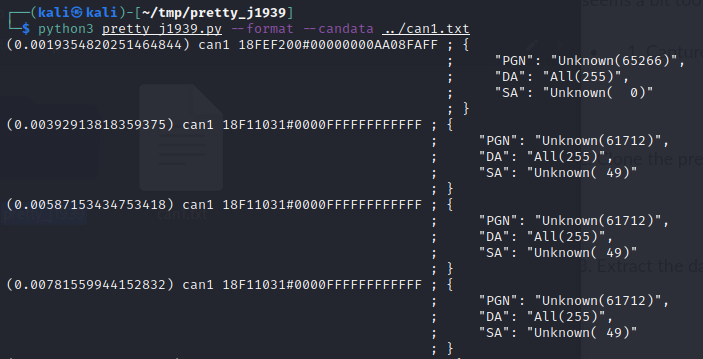

As expected, we don't have our answer yet. It seems like it did parse our data but it couldn't identify them, decode them or put them in relation to actual data so we must have missed something. After looking more at the description of the tool, we can see that we need to fill the database to parse and identify successfully our data and to do that, there is actually a python module that exists but it needs the **Official J1939 Digital Annex** from the SAE that costs like 200$ so that's clearly not the way to go.

  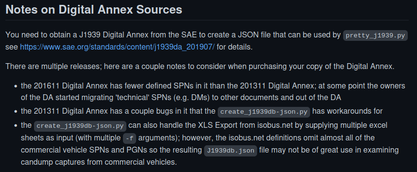

At this point, I've tried to find the annex somewhere else or to try to find an already built database from other tools but no luck. All I found was an old database that didn't include the information we needed and it also lacked some information to work correctly with *pretty_j1939*. From there, the road is splitting itself into two so let's have a look at the first option we have.

### The (more or less) intended way :

Until now, we haven't been able to find the right database even though we've searched a long time on Google, checked a lot of articles and Github repositories but no luck. However, there is still something that we didn't use but that could be important, the title of the challenge : **devil**. At first sight, it  has nothing to do with any of what we've been working on since the beginning so why would the author name his challenge like that ?... Yeah you thought about a hint too, right ? So, time to check that assumption with our friend Google and here we are, a new Github repository that has *devil* in its name and is about J1939 protocol :

  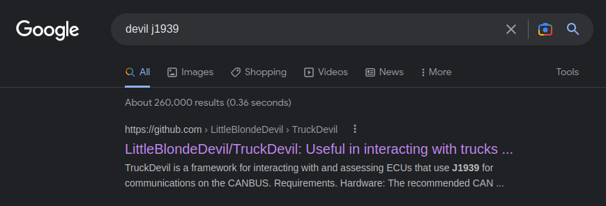

Apparently, we can't extract data from a capture directly by using this framework but it seems like they have an already filled database that we could use. Let's first check quickly our empty database so that we know what information we are looking for :

  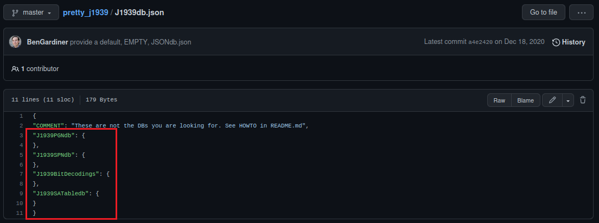

**Note :** *It was actually possible to use TruckDevil in combination to another tool that would have replayed our capture but since I didn't explore this option myself and it is already documented elsewhere, I decided to let this writeup as it is, guiding you through other ways even if they are less straightforward.*

Since *pretty_j1939* is using json file as its database, that's what we'll be looking for first in the *TruckDevil* repository and there it is, everything we need :

  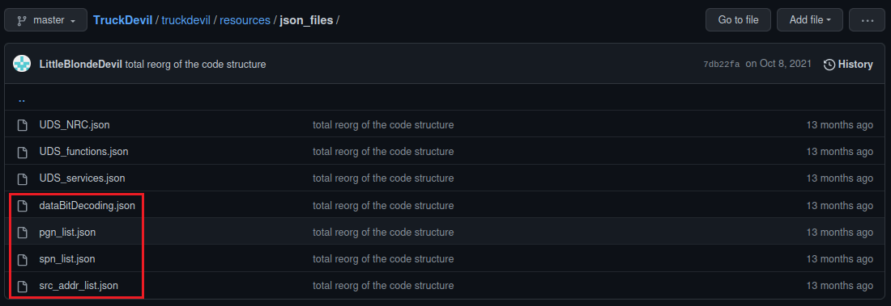

Now, you can just fill the database of *pretty_j1939* using the files listed above but in case you just want to check the result quickly without making any effort, I'll also include the database in this repo. There were some basic compatibility issues with the data to fix in order to be able to use it with *pretty_j1939*. The first one was an empty SPN entry and the second one was a difference of naming for PGN's labels. Once this is fixed, it's time to re-run the tool and admire the magic :

  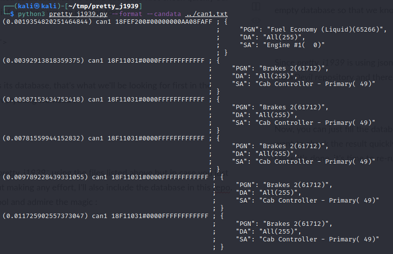

We now have successfully extracted the various information from our capture so it's the moment to look for the only value that is actually interesting for us : **"High resolution Maximum Speed"**. For some reasons, the tool doesn't provide us the values directly but it might be just that I don't know how to use it. Anyways, we're close enough to conclude this manually. By searching through our database, we can find a parameter that seems relevant to our challenge :

  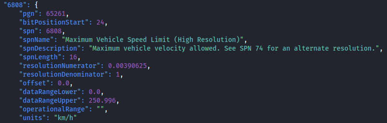

We have a few important information here :
- The **PGN (65261)** will be useful to locate our information from the results
- Each PGN is associatied with multiple SPN that are individual parameters and each of them occupy one or more bytes of data so here, the parameter *bitPositionStart* is important to locate the right value among the others
- *spnLength* tells us that our value is **2-bytes long**
- The unit is **km/h** which is what we're looking for but the *resolutionNumerator* and the *resolutionDenominator* are very important since they'll be giving us the right the scale so whatever our result will be, we'll have to multiply it by **0.00390625**.

Let's use this information to analyze our results :

  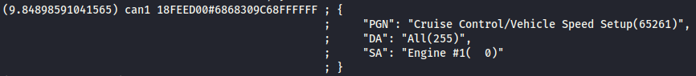

From the documentation or various articles, you can determine that the actual values of each piece of information are contained in the last part `6868309C68FFFFFF` and as we've seen it in the list above, the only 2 bytes that interest us are `9C68`. You might not think about it directly which is normal but you can find plenty of ways to find that this value is in little-endian, meaning that it should be read from the right to the left, byte by byte, which gives us `0x689c = 26780 --> 26780*0.00390625 = 104.609375 km/h`. (We will see in the second way to solve this chall how we could have find about the endianness)

It's now time to check if our solution is right or if something went wrong somewhere :

  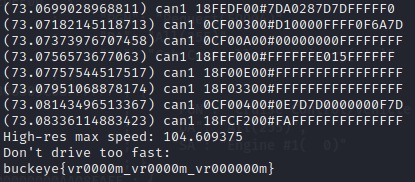

Congrat's on reading this far, we've got our flag : `buckeye{vr0000m_vr0000m_vr000000m}`

### The way I followed (fully manual) :
**Note :** *This is clearly not the most straightforward way to solve this and you might identify some redundancy but I wanted to describe faithfully the path I've followed during the competition.*

If you've read the previous section, remember that at this point we were looking for a database to use and we found it thanks to the *TruckDevil* repository but unfortunately, I wasn't able to find this during the competition. I've literally done all the possible search on Google by using all the potential combinations of *devil* and any keyword related to this challenge such as *j1939*, *isobus*, *can protocol*, *truck*... and I even combine those with Google's tricks such as `site:github.com` to focus only the results from *github.com* since I was expecting another tool or a database repository of some sort but nothing... 

  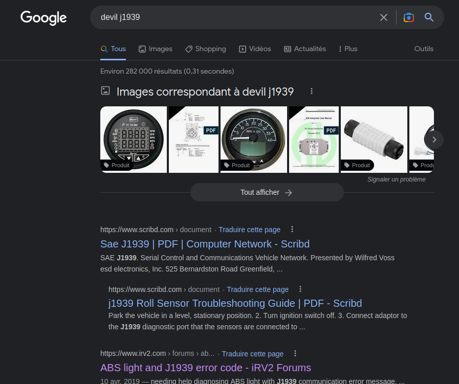

As you can see, the repository that should be in the first results actually never showed up for me. I've tried every possible kind of combinations and I went through many Google pages but nothing... For some reasons, I couldn't find the Github repository so I had to find another way to solve this.

Among all these results, I've found something useful : the [ISOBUS 11783 Online Data Base](https://isobus.net). **ISOBUS 11783** is a communication protocol for the agricultural sector that is **based on the SAE J1939 specification**. Therefore, it has a lot in common with the protocol we've been investigating on since the beginning and the good news is that this website includes the list of the parameters and data that it is supported by this protocol and their associated PGN/SPN. I won't go here into to much details about how the protocol works or what are PGN and SPN but if you're interested in understanding what you're reading about, you can start with this link [Intro to J1939](https://www.csselectronics.com/pages/j1939-explained-simple-intro-tutorial).

Let's have a look to the SPN list to try to find a parameter that would match the information we're looking for, let's start with a search with the keyword `speed` :

  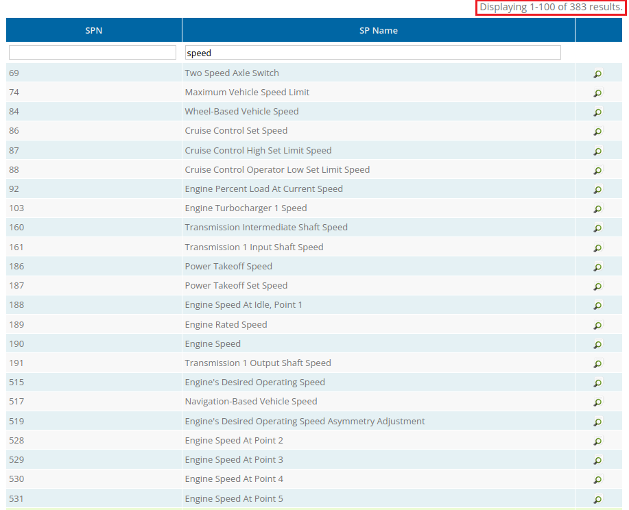

As you can see in the top right corner, there are almost 400 hundred parameters about speed so before we've to look at every one of them, let's try another research. As we know we're looking a "High Resolution" value of a parameter, let's see if we can limit the number of results by looking at these specific parameters only :

  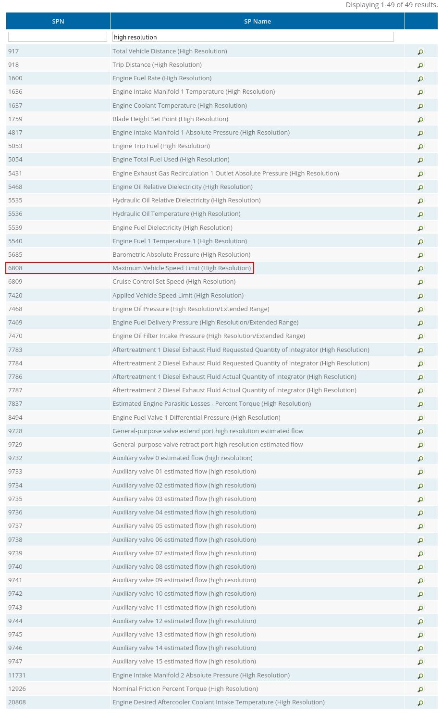

	We are now down to 49 parameters only and it seems like we've found something interesting : **Maximum Vehicle Speed Limit (High Resolution)**. The question we've seen in the description of the challenge was : "What is the high resolution maximum speed this truck **can be driven** ?" which actually makes perfect sense with a maximum vehicle speed **limit**. We now know that we're looking for the `SPN 6808`  and if we click on it, we can see it's associated with the `PGN 65261` :

  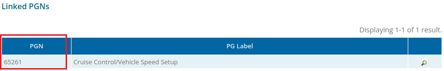

Now, if we comeback to our prettified capture, we can see that this PGN appears 5 times in the capture, with the same value so we can pick any of those...

  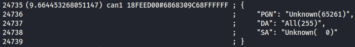

...but the question is, what do we do next ? How to extract manually the information we're looking for from this data ? I've found a preliminary answer on this <a href="https://www.linkedin.com/pulse/how-decode-can-bus-messages-molie-tudor-mihai">article</a> that I've summarized below with an example from our case what I've learned there and that could be useful to us :

  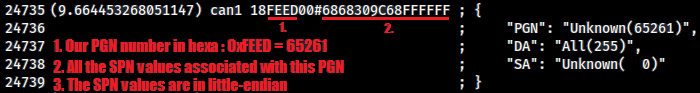

Now, we need to find which bytes belong to our SPN and to do that, I went through so many pages on Google... You know all these result pages that usually, no one ever look at... These poor pages that no one ever care about... Well, for once, I've decide to give them some credit and they reciprocated with two different websites. From the first website (can't retrieve the link, sorry), I've been able to get these details :

  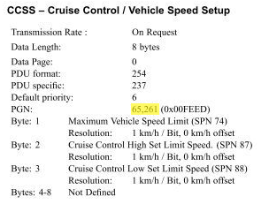

Unfortunately, as you might have seen it, our SPN isn't here. The version of the protocol described in this document was too old but we still have interesting information. For instance, we can see that the first byte of the SPN values is actually also the maximum vehicle speed limit but in a lower resolution than the one we're looking for. However, this is still valuable as it can give us an idea of the value we are looking so that we can avoid some basic errors (wrong endianness, wrong unit etc). This gives us the following in our case : (we don't know the unit but looking at the value, km/h would make sense as it doesn't just look reasonable but it's also the unit we're aiming at for the final answer)

  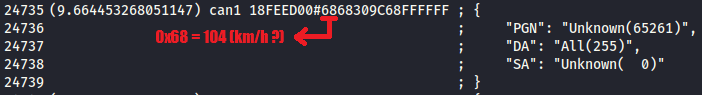

From there and thanks to all the other websites, articles and documentation I've read during the CTF, it was clear that the two bytes `9C68` were the two bytes we are interesting in from the SPN values `6868309C68FFFFFF`. My reasoning here is that the three first bytes, as we've seen it above, are used by three other "regular" SPN and `FF` bytes seem to be used sometimes as placeholder for future parameters and they clearly don't like a real value that could be of interest for us. Finally, the reason I think that our SPN uses two bytes and not only one like the three others is because its value is in `High Resolution` and all the other parameters in high resolution I've seen in the documentation were also using two bytes with a different unit so it can add more precision to the value. We can already convert this from hexadecimal to a decimal value, without forgetting about the endianness, and it gives us the following : `0x689c = 26780`. Mmmh ok, that's nice but we clearly needs one more information to be able to use this value... What unit is that ?!

To answer this question, if you remember, I talked to you about **two** websites earlier and that's the moment where the second one comes into play with the following details :

  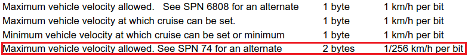
  <label>
<a href="https://pdfcoffee.com/download/j1939daserial-control-module-2019xls-pdf-free.html">pdfcoffee.com_j1939daserial-control-module-2019xls-pdf-free.pdf</a>
</label>

First of all, it confirms us that we were right about expecting the SPN 6808 to be 2-bytes long and then, the **Graal** (or just "unit" depending how long you've been looking for this) is right next to that information. We can now convert the value we just found : `26780 / 256 = 104.609375 km/h`

WE NOW HAVE OUR FINAL  ANSWER !! Congratulations for reading **this** far, only true ones could have done it !! 🎉

It's time to claim our prize :

  

At the end of this path, we've got our flag too : `buckeye{vr0000m_vr0000m_vr000000m}` 😁 !

